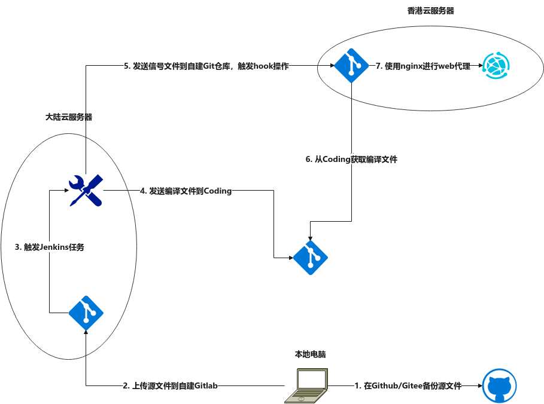

# 部署

关于博客网站的部署，着实耗费了不少的功夫。因为要考虑到一些功能和约束，所以经过了多次修改。目前的博客网站的部署已经相对复杂了很多，下面详细介绍其中的细节，给大家一个参考

## 功能和约束

功能：

1. 博客网站能够对外提供稳定的连接服务；
2. 能够实现源文件自动编译（持续集成）；
3. 能够实现编译文件自动部署（持续部署）。

约束：

1. 部署在大陆服务器上的博客网站需要备案；
2. 已备案的网站不能在文章中提供对外链接。

## 解决方案

* 首先为了能够提供稳定的对外连接服务，将博客网站部署在云服务器上；
* 其次为了能够实现源文件自动编译，在云服务器上搭建了`Gitlab`和`Jenkins`，将源码上传到`Gitlab`后触发`Jenkins`进行自动编译；
* 另外为了能够实现编译文件自动部署，在云服务器上自建一个`Git`仓库，通过`Nginx`进行挂载；
* 为了解决部署在大陆服务器上的博客网站需要备案的约束，在阿里云上申请域名和`SSL`服务；
* 为了解决已备案的网站不能在文章中提供对外链接的约束，在香港服务器上部署博客网站；

## 整体架构

