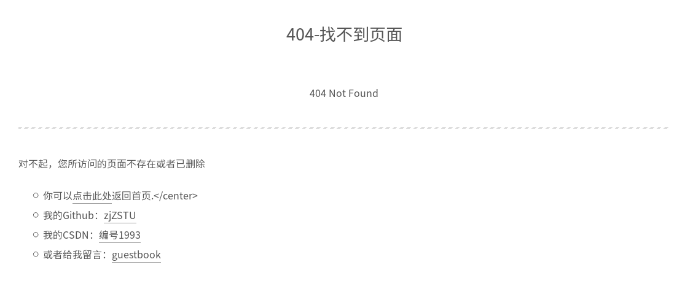
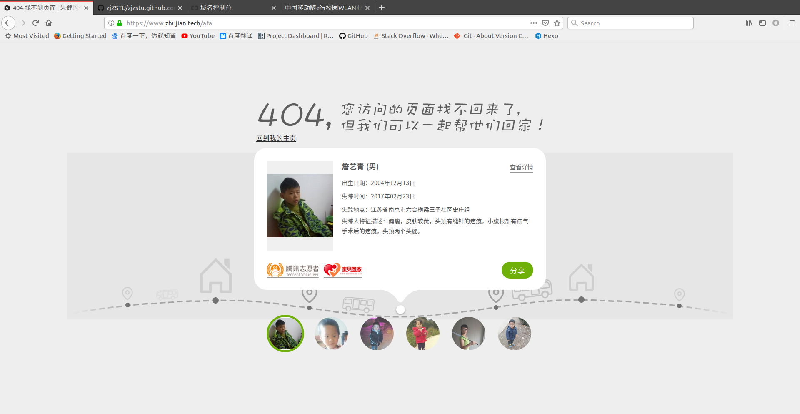

# 404页面

设置`404`页面，输入错误网址将跳转到`404`

## 配置

参考：[404.md](https://raw.githubusercontent.com/Neveryu/Neveryu.github.io/resource/source/404.md)

在`source`文件夹下新建文件`404.md`，输入以下内容

    ---
    title: 404-找不到页面
    date: 2019-01-25 14:16:18
    comments: false
    ---

    
404 Not Found

    ---

    对不起，您所访问的页面不存在或者已删除
    * 你可以[点击此处](https://blog.zhujian.life)返回首页
    * 我的Github：[zjZSTU](https://github.com/zjZSTU)
    * 我的CSDN：[编号1993](https://blog.csdn.net/u012005313)  
    * 或者给我留言：[guestbook](https://github.com/zjZSTU/guestbook)

本地服务器无法成功跳转，但是部署到服务器后，输入错误的网址能够自动跳转到404页面

## 公益404页面

使用[公益 404 页面](https://www.qq.com/404/)，在`404.md`上添加如下代码

    

输入错误网址，将会跳转到公益`404`页面

## 重定向

如果使用新的网址，可以利用`404`进行重定向，参考[404.html](https://github.com/jiexishede/jiexishede.github.io/blob/master/404.html)