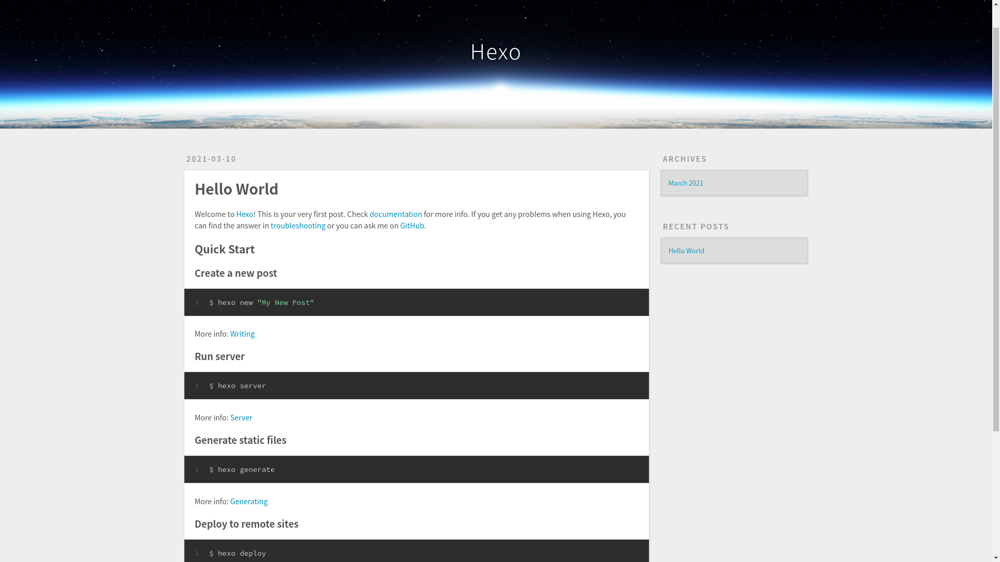

# 新建网站

`Hexo`提供了一个初始网站模板：[hexojs/hexo-starter](https://github.com/hexojs/hexo-starter)

## 网站初始化

    $ hexo init blogs
    INFO  Cloning hexo-starter https://github.com/hexojs/hexo-starter.git
    Cloning into '/home/zj/Videos/blog.zhujian.life/blogs'
    ...
    INFO  Start blogging with Hexo!

主要文件及目录如下


```
.
├── _config.landscape.yml    // 主题配置文件
├── _config.yml                          //  配置文件
├── node_modules                   //  nodeJS模块库
├── package.json                       //  配置环境
├── package-lock.json
├── scaffolds                                // 脚手架文件夹，生成文章、草稿、页面的模板
├── source                                    // 源文件
└── themes                                   // 主题
```

## 本地预览

```
$ hexo server
INFO  Validating config
INFO  Start processing
INFO  Hexo is running at http://localhost:4000 . Press Ctrl+C to stop.
```

在浏览器登录`http://localhost:4000`

