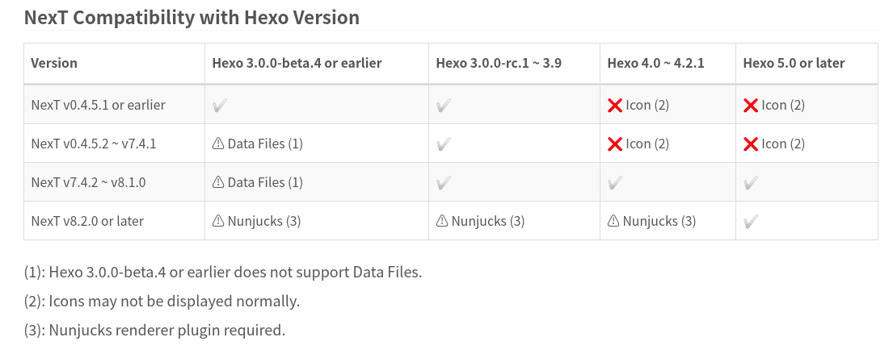

# Hexo-NexT

当前使用的版本为：

1. [Hexo: v5.4.0](https://hexo.io/news/2021/02/21/hexo-5-4-0-released/)
2. [NexT: v8.2.2](https://theme-next.js.org/next-8-2-2-released/)

*`8.x`的`NexT`相比于之前的`6.x/7.x`又发生了巨大的变化，集成了更多的功能，不再需要频繁的深入到源码进行调整*

## 官方文档

* [NexT Documentation](https://theme-next.js.org/docs/)
* [Hexo Documentation](https://hexo.io/docs/)

## 版本兼容

`NexT`和`Hexo`之间的版本兼容性参考[Upgrade](https://theme-next.js.org/docs/getting-started/upgrade.html#NexT-Compatibility-with-Hexo-Version)

## NexT地址

`NexT`的仓库地址经过了几次变化，参考[NexT Repositories](https://theme-next.js.org/docs/getting-started/upgrade.html#NexT-Repositories)

<table class="tg">
<thead>
  <tr>
    <th class="tg-jw1t">Years</th>
    <th class="tg-jw1t">Version</th>
    <th class="tg-jw1t">Repository</th>
  </tr>
</thead>
<tbody>
  <tr>
    <td class="tg-vg0e">2014 ~ 2017</td>
    <td class="tg-vg0e">v5</td>
    <td class="tg-vg0e"><a href="https://github.com/iissnan/hexo-theme-next">https://github.com/iissnan/hexo-theme-next</a></td>
  </tr>
  <tr>
    <td class="tg-vg0e">2018 ~ 2019</td>
    <td class="tg-vg0e">v6 ~ v7</td>
    <td class="tg-vg0e"><a href="https://github.com/theme-next/hexo-theme-next">https://github.com/theme-next/hexo-theme-next</a></td>
  </tr>
  <tr>
    <td class="tg-vg0e">2020</td>
    <td class="tg-vg0e">v8</td>
    <td class="tg-vg0e"><a href="https://github.com/next-theme/hexo-theme-next">https://github.com/next-theme/hexo-theme-next</a></td>
  </tr>
</tbody>
</table>