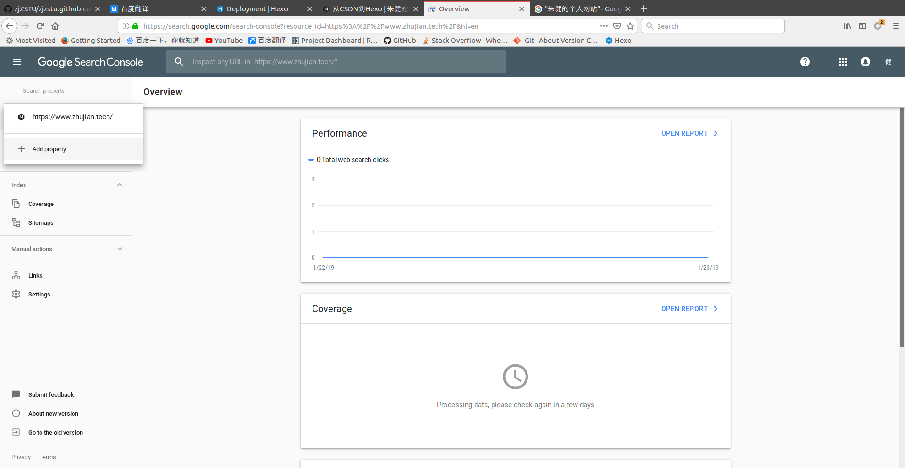
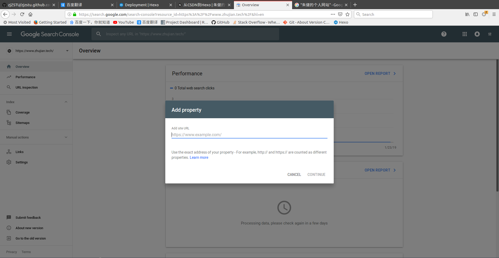
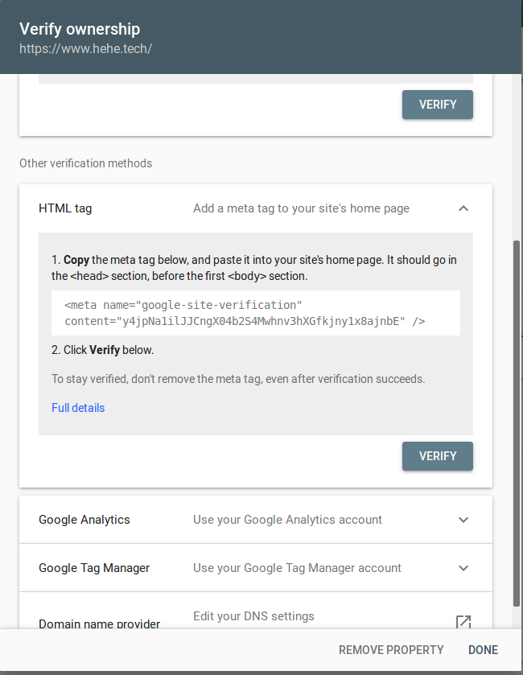
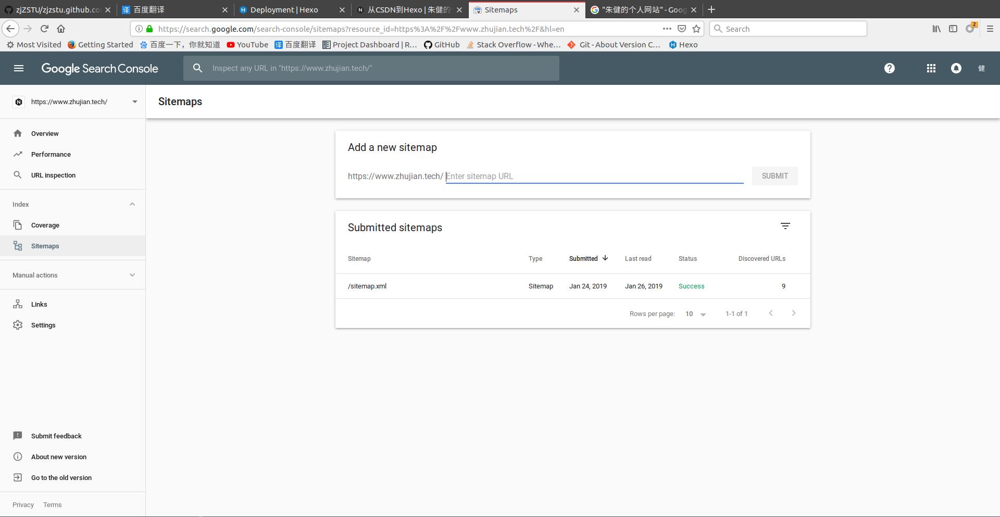
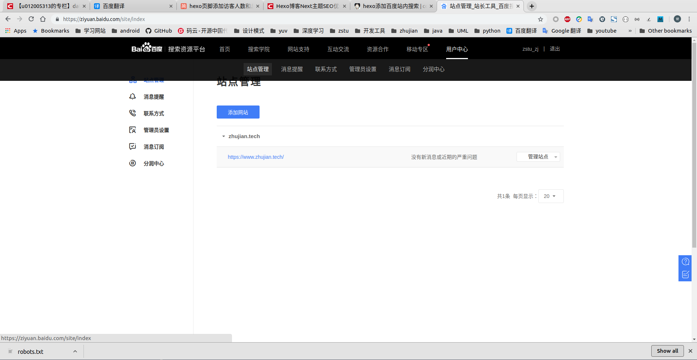

# [Baidu][Google]站点地图

参考：[Hexo博客Next主题SEO优化方法](https://blog.csdn.net/yaoyao_liu/article/details/85948136)

通过设置站点地图(`sitemap`)，可以让搜索引擎获取你的页面信息，这样可以增加别人搜索到你的几率

## 测试

测试搜索引擎是否已收录你的网站信息，输入

    site:网址

## 生成站点地图

设置百度和`google`的站点地图

    $ npm install hexo-generator-sitemap --save
    $ npm install hexo-generator-baidu-sitemap --save

添加`Hexo _config.yml`，并修改属性`url`为你的域名地址

    # URL
    ## If your site is put in a subdirectory, set url as 'http://yoursite.com/child' and root as '/child/'
    url: https://blog.zhujian.life
    ...
    ...

    sitemap: 
        path: sitemap.xml
    baidusitemap:
        path: baidusitemap.xml

重新生成静态文件，可以在`public`文件夹内发现`sitemap.xml`和`baidusitemap.xml`

    hexo clean & hexo generate

## `google`站点地图

进入[google搜索平台](https://search.google.com/search-console)，添加网址

`google`会要求进行网址验证，有多种方法，我使用第二种`HTML tag`

复制上面的元数据到首页的`<head>`小节，然后点击`VERIFY`

`NexT`主题已集成该验证实现

    # /themes/next/layout/_partials/head/head.swig
    
        <meta name="google-site-verification" content="{{ theme.google_site_verification }}"/>
    

只需要`NexT _config.yml`中填入`content`验证码即可

    # Google Webmaster tools verification setting
    # See: https://www.google.com/webmasters
    google_site_verification: 

点击`Sitemaps`，输入站点地图文件地址，选择`SUBMIT`即可

## 百度站点地图

参考：

[hexo-generator-baidu-sitemap](https://www.npmjs.com/package/hexo-generator-baidu-sitemap)

[百度站长平台添加网站管理](https://segmentfault.com/a/1190000017986794#articleHeader18)

其操作和`google`类似，选择`用户中心->站点管理`

输入网址，进行验证

    # Baidu Webmaster tools verification setting
    # See: https://ziyuan.baidu.com/site
    baidu_site_verification: 

### 推送

点击`数据引入->链接提交`，可以发现百度有多种推送方式

1. 主动推送(实时)
2. 自动推送
3. `sitemap`
4. 手动推送

自动推送指页面被访问时将页面`URL`立即被推送给百度，`NexT`主题已集成，打开`_config.yml`中的开关

    # Enable baidu push so that the blog will push the url to baidu automatically which is very helpful for SEO.
    baidu_push: false

主动推送需要插件[hexo-baidu-url-submit](https://github.com/huiwang/hexo-baidu-url-submit)，参考[Hexo插件之百度主动提交链接 ](https://hui-wang.info/2016/10/23/Hexo%E6%8F%92%E4%BB%B6%E4%B9%8B%E7%99%BE%E5%BA%A6%E4%B8%BB%E5%8A%A8%E6%8F%90%E4%BA%A4%E9%93%BE%E6%8E%A5/)

    $ npm install hexo-baidu-url-submit --save

修改工程`_config.yml`，添加

    # URL
    url: http://www.hui-wang.info

    deploy:
        - type: s3 ## 这是我原来的deployer
        - type: baidu_url_submitter ## 这是新加的

    baidu_url_submit:
        count: 1 ## 提交最新的一个链接
        host: www.hui-wang.info ## 在百度站长平台中注册的域名
        token: your_token ## 请注意这是您的秘钥， 所以请不要把博客源代码发布在公众仓库里!
        path: baidu_urls.txt ## 文本文档的地址， 新链接会保存在此文本文档里

## `Robots`文件

`robots.txt`可以告诉搜索引擎可以抓取哪些页面，不可以抓取哪些页面。

可以通过[robots](https://ziyuan.baidu.com/robots/index)生成，将它放置在`source`目录下

    User-agent: *
    Allow: /
    Allow: /archives/
    Allow: /categories/
    Allow: /tags/ 
    Allow: /resources/ 
    Disallow: /vendors/
    Disallow: /js/
    Disallow: /css/
    Disallow: /fonts/
    Disallow: /vendors/
    Disallow: /fancybox/

    Sitemap: https://blog.zhujian.life/sitemap.xml
    Sitemap: https://blog.zhujian.life/baidusitemap.xml

将`Sitemap`属性值替换成自己的地址