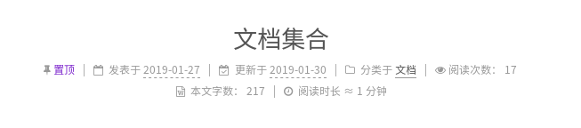
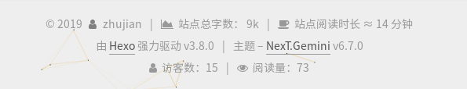

# [不蒜子]文章阅读次数

参考：

[不蒜子](http://ibruce.info/2015/04/04/busuanzi/)

[Busuanzi Counting (China)](https://theme-next.org/docs/third-party-services/statistics-and-analytics)

`NexT`主题已集成了不蒜子的访客人数和文章阅读统计功能

修改`NexT _config.yml`

    # Show Views/Visitors of the website/page with busuanzi.
    # Get more information on http://ibruce.info/2015/04/04/busuanzi
    busuanzi_count:
        enable: true
        total_visitors: true
        total_visitors_icon: user
        total_views: true
        total_views_icon: eye
        post_views: true
        post_views_icon: eye

设置`enable`为`true`即可。在底部可以看见访客人数和文章阅读次数

不在首页显示每篇文章的阅读次数，点击全文阅读即显示阅读次数



## 添加中文标识

修改文件`layout/_third-party/statistics/busuanzi-counter.swig`

添加中文提示符`访客数：`和`阅读量：`

```
  
    <span class="post-meta-item" id="busuanzi_container_site_uv" style="display: none;">
      <span class="post-meta-item-icon">
        <i class="fa fa-{{ theme.busuanzi_count.total_visitors_icon }}"></i>
      </span>
      <span class="site-uv" title="{{ __('footer.total_visitors') }}">
        访客数：<span id="busuanzi_value_site_uv"></span>
      </span>
    </span>
  

  
    <span class="post-meta-divider">|</span>
  

  
    <span class="post-meta-item" id="busuanzi_container_site_pv" style="display: none;">
      <span class="post-meta-item-icon">
        <i class="fa fa-{{ theme.busuanzi_count.total_views_icon }}"></i>
      </span>
      <span class="site-pv" title="{{ __('footer.total_views') }}">
        阅读量：<span id="busuanzi_value_site_pv"></span>
      </span>
    </span>
  
```


