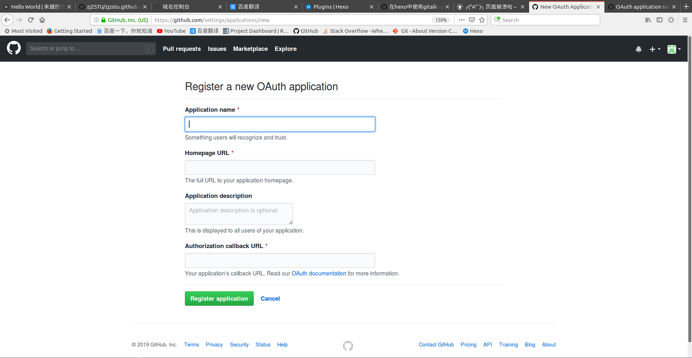

# [Gitalk]评论系统

`NexT`集成了多种评论系统，当前使用`Gitalk`

## 简介

[gitalk](https://github.com/gitalk/gitalk/blob/master/readme-cn.md)是一个基于`github`开发的评论插件，它将文章评论以`issues`形式保存在`github`仓库中

实现步骤如下：

1. 注册`github`应用
2. `NexT`配置

## 注册github应用

进入`github`注册页面：[Register a new OAuth application ](https://github.com/settings/applications/new)



* `Application name`：应用名，方便起见直接填`github`用户名
* `Homepage URL`：网站地址
* `Application description`：应用描述
* `Authorization callback URL`：网站地址

注册成功后会生成`Client ID`和`Client Secret`

## NexT配置

修改主题`_config.yml`

```

# Gitalk
# For more information: https://gitalk.github.io
gitalk:
  enable: true
  github_id: zjykzj # GitHub repo owner
  repo: guestbook # Repository name to store issues
  client_id: e15xxxxx63dce # GitHub Application Client ID
  client_secret: 76cxxxxxf766 # GitHub Application Client Secret
  admin_user: zjykzj # GitHub repo owner and collaborators, only these guys can initialize gitHub issues
  distraction_free_mode: true # Facebook-like distraction free mode
  # When the official proxy is not available, you can change it to your own proxy address
  proxy: https://cors-anywhere.herokuapp.com/https://github.com/login/oauth/access_token # This is official proxy adress
  # Gitalk's display language depends on user's browser or system environment
  # If you want everyone visiting your site to see a uniform language, you can set a force language value
  # Available values: en | es-ES | fr | ru | zh-CN | zh-TW
  language: zh-CN
```

* 设置`enable`为`true`
* `github_id`填入`github`帐号
* `repo`填入`github`仓库名（**注意：是仓库名不是仓库地址**），评论将会以`issues`形式保存在该仓库下
* `client_id`填入注册生成的值
* `client_secret`填入注册生成的值
* `admin_user`填入`github`帐号，用于初始化评论账户

## `Error: Not Found`

问题描述：在文章底部评论框中出现错误信息

    Error: Not Found

解决：和配置选项的填写有关，注意填写的内容

## 隐藏评论框

设置`gitalk`评论系统后，将会在每篇文章末尾添加评论框，而对于标签页/类别页等不需要评论的文章，可在`front-matter`设置属性进行隐藏

    comments: false

## Error: Request failed with status code 403

这是由于代理服务器出错的问题，经过查询，发现是`NexT`提供的反向代理已停止服务

```
  # When the official proxy is not available, you can change it to your own proxy address
  proxy: https://cors-anywhere.herokuapp.com/https://github.com/login/oauth/access_token # This is official proxy adress
  # Gitalk's display language depends on user's browser or system environment
```

当前的解决方案就是自己新建一个反向代理服务器，启动`nginx`服务，配置如下：

```
   location = /login/oauth/access_token {
       add_header Access-Control-Allow-Origin 'https://xxx.xxx.xxx';
       add_header Access-Control-Allow-Methods 'GET, POST, OPTIONS';
       add_header Access-Control-Allow-Headers 'DNT,X-Mx-ReqToken,Keep-Alive,User-Agent,X-Requested-With,If-Modified-Since,Cache-Control,Content-Type,Authorization';
       if ($request_method = 'OPTIONS') {
             return 204;
       }
       proxy_pass https://github.com;
   }
```

自定义反向代理以重定向`github`地址，使用如下地址进行替换：

```
https://xxx.xxx.xxx/login/oauth/access_token
```

## 相关阅读

* [Gitalk](https://theme-next.js.org/docs/third-party-services/comments.html)
* [Hexo 搭建：配置 Gitalk 评论系统](https://blog.csdn.net/qq_36537546/article/details/90730412)
* [gitalk提示Error Not Found #130](https://github.com/Molunerfinn/hexo-theme-melody/issues/130)
* [gitalk/gitalk](https://github.com/gitalk/gitalk/blob/master/readme-cn.md)
* [Hexo中Gitalk配置使用教程-可能是目前最详细的教程 | ioChen's Blog #3](https://github.com/iosite/gitalk/issues/3)
* [ hexo next 主题配置 gitalk 评论后无法初始化创建 issue #115 ](https://github.com/gitalk/gitalk/issues/115)
* [解决使用 Gitalk 登录授权报 403 的问题](https://www.qiansw.com/solve-the-problem-of-using-gitalk-authorization-403.html)
* [Error: Request failed with status code 403](https://ask.csdn.net/questions/7125029)
* [PSA: Public demo server (cors-anywhere.herokuapp.com) will be very limited by January 2021, 31st #301](https://github.com/Rob--W/cors-anywhere/issues/301)
* [在授权gitalk后出现403错误 #429](https://github.com/gitalk/gitalk/issues/429)
* [为博客添加 Gitalk 评论区](https://syvshc.github.io/2021-03-05-enable-gitalk/)