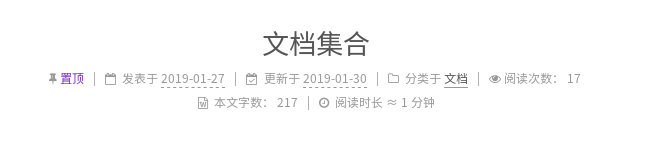

# [不蒜子]文章阅读次数

`NexT`主题已集成了不蒜子的访客人数和文章阅读统计功能

## 配置

修改`NexT _config.yml`

    # Show Views/Visitors of the website/page with busuanzi.
    # Get more information on http://ibruce.info/2015/04/04/busuanzi
    busuanzi_count:
        enable: true
        total_visitors: true
        total_visitors_icon: user
        total_views: true
        total_views_icon: eye
        post_views: true
        post_views_icon: eye

设置`enable`为`true`即可。

* 在首页显示文章的阅读次数
* 点击全文阅读显示阅读次数
* 在底部可以看见访客人数和文章阅读次数

## 相关阅读

* [Busuanzi Counting (China)](https://theme-next.js.org/docs/third-party-services/statistics-and-analytics.html#Busuanzi-Counting-China)
* [不蒜子](http://ibruce.info/2015/04/04/busuanzi/)