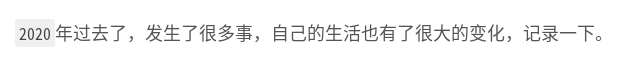
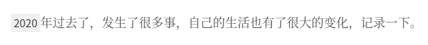

# 字体设置

## NexT _config.yml

默认`NexT`使用微软雅黑字体，当前调整中文字体为思源宋体（`Noto Serif SC`）

修改`NexT _config.yml`

```
# ---------------------------------------------------------------
# Font Settings
# ---------------------------------------------------------------
# Find fonts on Google Fonts (https://fonts.google.com)
# All fonts set here will have the following styles:
#   light | light italic | normal | normal italic | bold | bold italic
# Be aware that setting too much fonts will cause site running slowly
# ---------------------------------------------------------------
# Web Safe fonts are recommended for `global` (and `title`):
# Arial | Tahoma | Helvetica | Times New Roman | Courier New | Verdana | Georgia | Palatino | Garamond | Comic Sans MS | Trebuchet MS
# ---------------------------------------------------------------

font:
  enable: true

  # Uri of fonts host, e.g. https://fonts.googleapis.com (Default).
  host: https://fonts.lug.ustc.edu.cn

  # Font options:
  # `external: true` will load this font family from `host` above.
  # `family: Times New Roman`. Without any quotes.
  # `size: x.x`. Use `em` as unit. Default: 1 (16px)

  # Global font settings used for all elements inside <body>.
  global:
    external: true
    # family: Lato
    family: Noto Serif SC
    size:

  # Font settings for site title (.site-title).
  title:
    external: true
    family:
    size:

  # Font settings for headlines (<h1> to <h6>).
  headings:
    external: true
    family:
    size:

  # Font settings for posts (.post-body).
  posts:
    external: true
    family:

  # Font settings for <code> and code blocks.
  codes:
    external: true
    family:

```

* 设置`font enable`属性为`true`
* 设置`host`属性为`https://fonts.lug.ustc.edu.cn`
* 设置`global external`属性为`true`
* 设置`global family`属性为`Noto Serif SC`

## 预览

修改前：



修改后:



## 自定义

通过`NexT _config.yml`仅能替换中文字体/英文字体其中一种。通过自定义的方式设置中文字体，这样在`_config.yml`中配置英文字体即可

### 中文字体

修改`/source/css/_variables/base.styl`

```
// Font families.
// $font-family-chinese      = "PingFang SC", "Microsoft YaHei";
$font-family-chinese      = "Noto Serif SC"
```

修改`/layout/partials/head/head.njk`，在`next_font`添加

```
{{ next_font() }}

<link rel="stylesheet" href="{{ theme.vendors.fontawesome }}">

### 添加
<link href="https://fonts.googleapis.com/css?family=Noto+Serif+SC|Roboto&display=swap" rel="stylesheet">
```

### 大小调整

修改源文件`/source/css/_variables/base.styl`

```
// $font-size-smallest       = .75em;     # 12px
// $font-size-smaller        = .8125em;   # 13px

$font-size-smallest       = .625em;       # 10px
$font-size-smaller        = .75em;        # 12px
```

*`1em`等于`16px`*

## 相关阅读

* [Fonts Customization](https://theme-next.js.org/docs/theme-settings/miscellaneous.html?highlight=font+settings#Fonts-Customization)
* [hexo(Next主题)修改文字大小](https://blog.csdn.net/dpdpdppp/article/details/102387532)
* [Next修改字体](https://sxxkearth.github.io/2019/01/09/Next字体修改/)
* [WordPress谷歌公共库/谷歌字体国内镜像源地址对照列表](https://andyx.net/wordpress_google_public_library_google_font_china_sources_list/)
* [10种经典的谷歌开源英文字体，值得收藏！ ](http://www.sohu.com/a/243295326_495681)
* [google fonts](https://fonts.google.com/?selection.family=Noto+Serif+SC|Roboto&query=Roboto)