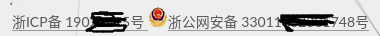
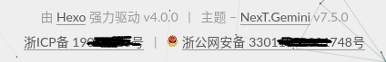

# 添加备案号

大陆网站上线需要备案，并在网站显示备案号；关于如何取消备案号，直接参考最后一章

## ICP备案和公安备案

`ICP`备案和公安备案的区别参考：[企业网站ICP备案 和 网站公安备案的区分](https://baijiahao.baidu.com/s?id=1623541530947349945&wfr=spider&for=pc)

### ICP备案

注册域名并绑定网址后还需要进行服务器备案，我把服务器搭建在腾讯云上，所以在腾讯云上进行`ICP`备案

具体备案流程参考[备案流程](https://cloud.tencent.com/document/product/243/18909)

大约花费了`2`周时间，今天发短信通知说备案成功了，还需要进行公安备案

### 公安备案

登录网址[全国互联网安全管理服务平台](http://www.beian.gov.cn)

1. 点击联网备案登录，注册个人帐号
2. 点击新办网站申请，提交相关信息

## 添加备案号 - NexT-v6.7.0

参考：

[hexo搭建的静态博客如何添加备案号？](https://www.zhihu.com/question/49931898)

[Hexo 页脚增加工信部备案和公安网备案展示](https://xian6ge.cn/posts/2da0ce2e/)

[Hexo添加域名备案图案及备案号到页脚](http://shauew.tech/2017/09/23/18.Hexo%E6%B7%BB%E5%8A%A0%E5%A4%87%E6%A1%88%E5%9B%BE%E6%A1%88%E5%8F%8A%E4%BF%A1%E6%81%AF%E5%88%B0%E9%A1%B5%E8%84%9A/)

还需要在网站底部添加备案号，`NexT`主题`6.x`版本已支持添加`ICP`备案号

进入主题`_config.yml`文件，搜索`beian`关键字

```
# Beian icp information for Chinese users. In China, every legal website should have a beian icp in website footer.
# http://www.miitbeian.gov.cn
beian:
    enable: false
    icp: 
```

设置`enable`为`true`，同时在`icp`属性上输入备案号即可

目前需要同时添加`ICP`备案号和公安备案号，参考修改如下

进入`themes/next/_config.yml`，添加`gongan`属性

```
beian:
    enable: true
    icp: ICP备案号
    gongan: 公安备案号
```

在全国互联网安全管理平台上下载国徽图标，放置在`/themes/next/source/images`下，命名为`beian_logo.png`

进入`themes/next/layout/_partials/footer.swig`，删除以下代码：

```
{# 
  #}  {{ next_url('http://www.miitbeian.gov.cn', theme.footer.beian.icp + ' ') }}{#
#}
```

在文件末尾添加如下代码：

```

  <div>
    {{ next_url('http://www.miitbeian.gov.cn', theme.footer.beian.icp) }}

    <span class="post-meta-divider">|</span>
  
    
    
    {{ next_url('http://www.beian.gov.cn/portal/registerSystemInfo?recordcode=公安备案号', theme.footer.beian.gongan) }}

  </div>


```

*全国互联网安全管理平台上也提供了一段`HTML`代码，用于在网站底部嵌入备案号，不过其样式不符合实际需求，所以修改如上所示*

## 添加备案号 - NexT-v7.5.0

`NexT`主题已集成了`ICP`备案和公安备案功能，进入`NexT _config.yml`

```
  # Beian ICP and gongan information for Chinese users. See: http://www.beian.miit.gov.cn, http://www.beian.gov.cn
  beian:
    enable: true
    icp: 浙ICP备 1902xxx
    # The digit in the num of gongan beian.
    gongan_id: 330xxx
    # The full num of gongan beian.
    gongan_num: 浙公网安备 330118xxx
    # The icon for gongan beian. See: http://www.beian.gov.cn/portal/download
    gongan_icon_url: /images/beian_icon.png
```

在全国互联网安全管理平台上下载国徽图标，放置在`/themes/next/source/images`下，命名为`beian_logo.png`



其显示效果不太理想，修改文件`layout/_partials/footer.swig`，删除以下代码

```

  <div class="beian">
    {{- next_url('http://www.beian.miit.gov.cn', theme.footer.beian.icp + ' ') }}
    
      
    
    {{- next_url('http://www.beian.gov.cn/portal/registerSystemInfo?recordcode=' + theme.footer.beian.gongan_id,
    theme.footer.beian.gongan_num + ' ') }}
  </div>

```

在末尾添加如下代码

```

  <div class="beian">
    {{ next_url('http://www.beian.miit.gov.cn', theme.footer.beian.icp) }}

    <span class="post-meta-divider">|</span>
  
    
   
    {{ next_url('http://www.beian.gov.cn/portal/registerSystemInfo?recordcode='+theme.footer.beian.gongan_id, theme.footer.beian.gongan_num) }}

  </div>


```



## 取消备案号

### 取消ICP备案

之前是在腾讯云上面完成备案的，所以取消备案也参考其文档进行：[注销主体](https://cloud.tencent.com/document/product/243/19150)

备案分为主体和网站两部分，一个主体下面可以连接多个网站。当前只有一个博客网站，所以直接注销主体就可以了

在微信中搜索**备案小程序**，按照文档的流程**注销主体**即可（*我是当天就有客服过来确认，然后当天就实现了在工信部取消备案号*）

### 取消公安备案

登录网址[全国互联网安全管理服务平台](http://www.beian.gov.cn)

1. 点击**联网备案登录**，输入个人帐号
2. 选择**网站注销申请**，拉取到最后一栏，输入验证码，点击注销即可
