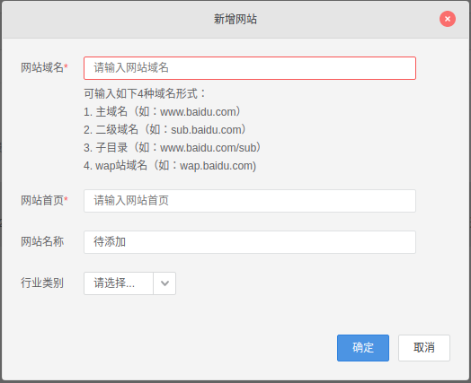

# [百度统计]网站访问

## 百度统计设置

登录[百度统计](https://tongji.baidu.com)后进入侧边栏`账户管理 -> 网站列表`，点击右侧`新增网站`按钮



添加`网站域名/网站首页`信息后，点击`确定`按钮，百度统计会提供一段`JS`脚本用于嵌入

```
<script>
var _hmt = _hmt || [];
(function() {
  var hm = document.createElement("script");
  hm.src = "https://hm.baidu.com/hm.js?xxxxxxxxxxxxxxxxxx";
  var s = document.getElementsByTagName("script")[0]; 
  s.parentNode.insertBefore(hm, s);
})();
</script>
```

## NexT _config.yml

修改`NexT _config.yml`，修改

```
# Baidu Analytics ID
baidu_analytics: 输入百度统计生成的键
```

设置完成后编译、部署，大约`20`分钟后就能查看网站分析数据了

## 相关阅读

* [Baidu Analytics (China)](https://theme-next.js.org/docs/third-party-services/statistics-and-analytics.html#Baidu-Analytics-China)
* [Hexo: 给博客添加百度统计](https://postgres.fun/20181027203300.html)