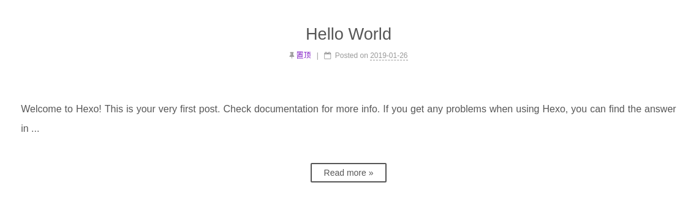

# 首页置顶

参考：[hexo博客优化之文章置顶+置顶标签](https://blog.csdn.net/qwerty200696/article/details/79010629)

## 默认设置

默认`hexo`使用插件[hexojs/hexo-generator-index](https://github.com/hexojs/hexo-generator-index)进行首页文章设置

    # Home page setting
    # path: Root path for your blogs index page. (default = '')
    # per_page: Posts displayed per page. (0 = disable pagination)
    # order_by: Posts order. (Order by date descending by default)
    index_generator:
        path: ''
        per_page: 10
        order_by: -date

* `path`：文章起始页面路径
* `per_page`：每页显示文章数量
* `order_by`：排序（默认按日期降序）

## 更新

网上有好几个更新后的插件版本，都能进行更为丰富的排序选择

* [YuyingWu/hexo-generator-index-plus](https://github.com/YuyingWu/hexo-generator-index-plus)
* [hexo-generator-index-updated](https://www.npmjs.com/package/hexo-generator-index-updated)
* [netcan/hexo-generator-index-pin-top](https://github.com/netcan/hexo-generator-index-pin-top)

以`hexo-generator-index-pin-top`为例，首先是卸载默认排序插件，安装新插件

    $ npm uninstall hexo-generator-index --save
    $ npm install hexo-generator-index-pin-top --save

然后在文章`front-matter`中设置`top: True`即可实现文章置顶功能，也可以赋值为数字，数字越大等级越高

```
---
title: Gh
abbrlink: e2aab
date: 201x-07 1:25
categories:
tags:
top: 1
---
```

## 图标

进入`NexT`主题下修改

    /themes/next/layout/_macro/post.swig

在`<div class="post-meta">`下加入置顶图标

```
...
...
<div class="post-meta">

    
        <i class="fa fa-thumb-tack"></i>
        <font color=7D26CD>置顶</font>
        <span class="post-meta-divider">|</span>
    
...
...
```

