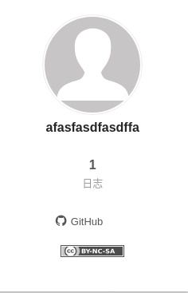
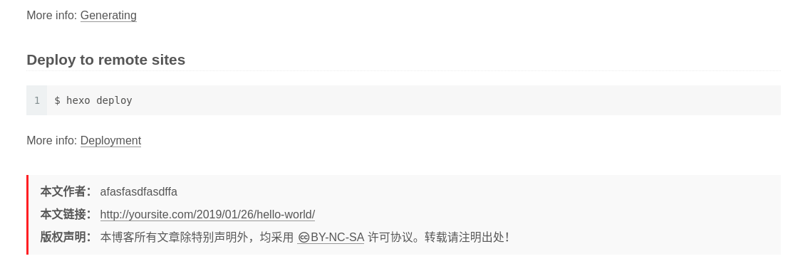

# 版权信息

## 配置

```
# Creative Commons 4.0 International License.
# See: https://creativecommons.org/about/cclicenses/
# Available values of license: by | by-nc | by-nc-nd | by-nc-sa | by-nd | by-sa | zero
# You can set a language value if you prefer a translated version of CC license, e.g. deed.zh
# CC licenses are available in 39 languages, you can find the specific and correct abbreviation you need on https://creativecommons.org
creative_commons:
  license: by-nc-sa
  sidebar: false
  post: false
  language:
```

* `license`表示当前使用协议`by-nc-sa`，可修改成你想要的
* `sidebar`表示是否显示在侧边栏
* `post`表示是否在文章底部显示





## `BY-NC-SA`

参考：[CC BY-NC-SA 4.0](https://creativecommons.org/licenses/by-nc-sa/4.0/deed.zh)

协议`BY-NC-SA`支持

* 共享 — 在任何媒介以任何形式复制、发行本作品
* 演绎 — 修改、转换或以本作品为基础进行创作

需要遵守

* 署名
* 非商业性使用
* 相同方式共享

## 相关阅读

* [Creative Commons](https://theme-next.js.org/docs/theme-settings/index.html?highlight=creative_commons)