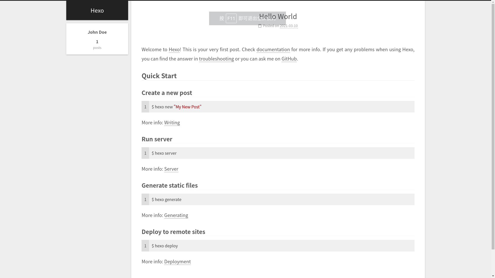
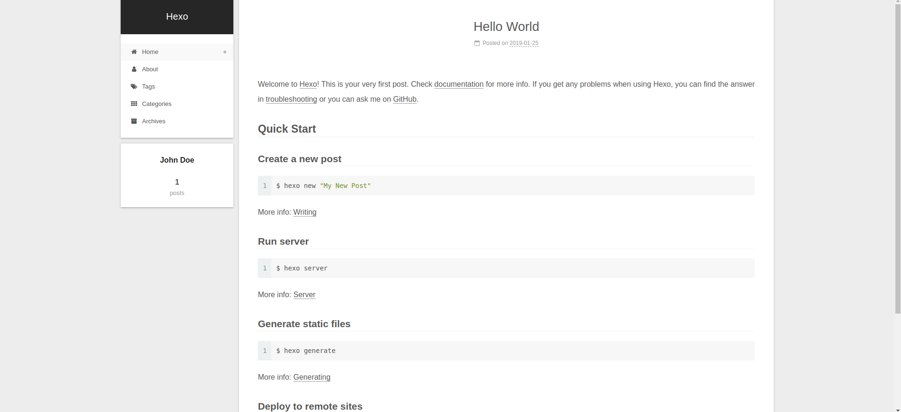
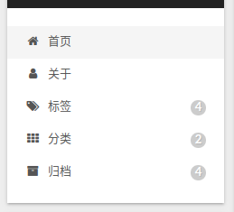

# 菜单栏

## 配置文件

`NexT`提供了菜单栏配置，查询`NexT _config.yml`

```
# ---------------------------------------------------------------
# Menu Settings
# ---------------------------------------------------------------

# Usage: `Key: /link/ || icon`
# Key is the name of menu item. If the translation for this item is available, the translated text will be loaded, otherwise the Key name will be used. Key is case-senstive.
# Value before `||` delimiter is the target link, value after `||` delimiter is the name of Font Awesome icon.
# External url should start with http:// or https://
menu:
  #home: / || fa fa-home
  #about: /about/ || fa fa-user
  #tags: /tags/ || fa fa-tags
  #categories: /categories/ || fa fa-th
  #archives: /archives/ || fa fa-archive
  #schedule: /schedule/ || fa fa-calendar
  #sitemap: /sitemap.xml || fa fa-sitemap
  #commonweal: /404/ || fa fa-heartbeat

# Enable / Disable menu icons / item badges.
menu_settings:
  icons: true
  badges: false
```



对需要的菜单项取消注释，就可以在页面上看到相应选项，同时还需要对一些选项进行配置



* 点击`about`选项会读取`/public/about/`路径下的`index.html`文件
* 点击`tags`会读取`/public/tags`下的`index.html`文件，类别选项同理

默认情况下这几个路径下的`index.html`文件为空，需要手动创建

## icons & badges

默认设置`icons`为`true`，将会在菜单栏显示图标（图标内容通过`|| home`、`|| user`方式设置）

```
Usage: `Key: /link/ || icon`
```

如果设置`badges`为`true`，将会显示在菜单栏中显示对应数目，比如显示标签条目中的标签个数，存储条目中的文章数目



## about页面

新建页面

    hexo new page about

在`source`文件夹下生成文件夹`about`，其文件结构如下

    .
    ├── index
    └── index.md

    1 directory, 1 file

修改`index.md`文件的`front-matter`，同时可以添加内容

    ---
    title: 关于
    date: 2019-01-23 23:30:47
    tags: about
    ---

    ...
    ...

*也可以手动在`source`目录下建立相应文件夹以及相应文件*

## 标签&类别

参考：[hexo 下的分类和表签无法显示，怎么解决？](https://www.zhihu.com/question/29017171?sort=created)

与`about`选项操作类似，新建页面文件`tags`和`categories`，同时修改其`.md`文件

    # tags.md
    ---
    title: 标签
    date: 2019-01-23 23:26:43
    type: tags
    ---
    # categories.md
    ---
    title: 类别
    date: 2019-01-23 23:27:04
    type: categories
    ---

**注意 1：需要手动添加`type: xxx`**

**注意 2：需要手动设置中文`title`**

## 相关阅读

* [Configuring Menu Items](https://theme-next.js.org/docs/theme-settings/index.html?highlight=menu+settings#Configuring-Menu-Items)